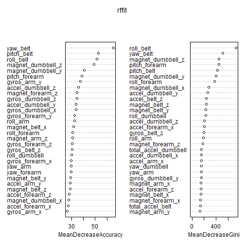

#Sinopsys
Using devices such as Jawbone Up, Nike FuelBand, and Fitbit it is now possible to collect a large amount of data about personal activity relatively inexpensively. These type of devices are part of the quantified self movement - a group of enthusiasts who take measurements about themselves regularly to improve their health, to find patterns in their behavior, or because they are tech geeks. One thing that people regularly do is quantify how much of a particular activity they do, but they rarely quantify how well they do it. In this project, my goal was to use data from accelerometers on the belt, forearm, arm, and dumbell of 6 participants. They were asked to perform barbell lifts correctly and incorrectly in 5 different ways. More information is available from the website here: http://groupware.les.inf.puc-rio.br/har (see the section on the Weight Lifting Exercise Dataset).

#Data Processing
###Global Config
We start with the basic configurations, setting the knitr to omit warnings and messages, turning off scientific notation and loading the required libraries.

```r
knitr::opts_chunk$set(echo=TRUE, warning=FALSE, message=FALSE) #setting globaly the code to be seen but not showing warnings or messages
options(scipen = 999) #turning off scientific notation
rm(list=ls())
#Loading libraries needed for the code
library(caret)
library(randomForest)
library(rattle)
library(dplyr)
```


###Getting and Cleaning the Data
After downloading, reading and doing some basic exploration, it is clear that there is a huge amount of NAs in the data-set. In order to clean it, we must determine the extension of the problem.

```r
if(!file.exists("pml-training.csv")) {
  download.file("https://d396qusza40orc.cloudfront.net/predmachlearn/pml-training.csv","pml-training.csv")
  download.file("https://d396qusza40orc.cloudfront.net/predmachlearn/pml-testing.csv","pml-testing.csv")
}

if(!exists("training")){
    training <- read.table("pml-training.csv",sep=",",header = TRUE,stringsAsFactors = FALSE,na.strings = c("NA","#DIV/0!"))
}

#Setting classe as a factor variable.
training$classe <- factor(training$classe)

if(!exists("testing")){
    testing <- read.table("pml-testing.csv",sep=",",header = TRUE,stringsAsFactors = FALSE,na.strings = c("NA","#DIV/0!"))
}

#Basic exploration
dim(training)
summary(training)
str(training)

#Finding NA Information
CompleteCases <- sum(complete.cases(training))
CompleteCases

naRows <- which(rowSums(is.na(training[, -c(1:7, 160)])) == 152)
naRows

nobs <- nrow(training)
naPercentage <- apply(training, 2, function(col) round(sum(is.na(col))/nobs, 2))
table1 <- table(naPercentage)
names(table1) <- paste0(as.factor(as.numeric(names(table1))*100),rep("% NA",dim(table1)))
table1

NAcols <- which(naPercentage>0.90)
training <- select(training,-NAcols)
training <- training[,-c(1:7)]
nzv <- nearZeroVar(training, saveMetrics=TRUE)
nzv
```

NA diagnostics and treatment was done like following:   
1. Determining the amount of Complete Cases. The result was **0**.   
2. Number of rows without NAs. The result was **0**.   
3. Calculating the % of NAs per column. As follows 

| 0% NA        | 98% NA           | 100% NA  |
| ------------- |:-------------:| -----:|
| 60      | 94 | 6 |

4. Removing columns with more than 90% of NAs and also, the information regarding the personal information of the users, getting down to 53 columns.   
5. The near zero values info made us conclude that the variables left in the dataset were good.   
   
###Cross Validation
In order to apply cross validation, we divided the training into 3 different sets: 60% for training, 20% for testing and 20% for validation.

```r
set.seed(33833)
InTrain <- createDataPartition(training$classe,p=0.6, list = F)
traintrain <- training[InTrain,] #60%
traintest <- training[-InTrain,] #40%

InTrain <- createDataPartition(traintest$classe,p=0.5, list = F)
trainvalidate <- traintest[InTrain,] #20%
traintest <- traintest[-InTrain,] #20%
```

###Predictions
Here we have applied 3 different methods.   
0. General Linear Method: not available for more than two outcomes.   
1. Boosting: Great method, achieved an amazing 94% accuracy, but took way over 20 minutes to run with only 60% of the data, so that is why it is commented here.   
2. Decision trees: Normally a good method but here it could not perform better than 52% accuracy and also, presented no leaf for the D class.   
3. Random Forests: Given what was learned in the previous methods, I tried to make a prediction with less variance thus using only the important variables given by the Boosting method. Using Carret's package (method="rf") the model took way too long to run, so I used randomForest() function from the original package showing a way faster result. There was no need to apply cv on Random Forests (package advantage) and to reduce the variables, since it does it by itself and a 99,4% accuracy was achieved. Then the same great result (99,4%) was achieved in the traintest so this model was chosen.   

```r
traincontrol <- trainControl(method = "cv",number = 5)
#boostfit <- train(classe~.,data=traintrain,method="gbm",trControl=traincontrol)
#summary(boostfit)
#result <- predict(boostfit,newdata = traintest)
#confusionMatrix(traintest$classe,result)
#Importance <- varImp(boostfit)
#Importance

#rpartfit <- train(classe~.,data=traintrain,method="rpart",trControl=traincontrol)
#rpartfit
#Importance <- varImp(rpartfit)
#Importance
#rpartfit <- train(classe~roll_belt+pitch_forearm+yaw_belt+magnet_dumbbell_y+magnet_dumbbell_z+roll_forearm+accel_dumbbell_y+roll_dumbbell+magnet_dumbbell_x+magnet_belt_y+accel_belt_z+total_accel_belt+magnet_arm_x+accel_arm_x+roll_arm,data = traintrain,method="rpart")
#result <- predict(rpartfit,newdata = traintest)
#confusionMatrix(traintest$classe,result)              

#rffit <- train(classe~roll_belt+pitch_forearm+yaw_belt+magnet_dumbbell_y+magnet_dumbbell_z+roll_forearm+accel_dumbbell_y+roll_dumbbell+magnet_dumbbell_x+magnet_belt_y+accel_belt_z+total_accel_belt+magnet_arm_x+accel_arm_x+roll_arm,data = traintrain,method="rf")
rffit <- randomForest(classe~.,data=traintrain,importance=TRUE)
rffit
varImpPlot(rffit)
```

 

```r
results1 <- predict(rffit,newdata = traintest)
confusionMatrix(traintest$classe,results1)

results2 <- predict(rffit,newdata = trainvalidate)
Matrix <- confusionMatrix(trainvalidate$classe,results2)
outofsampleerror <- (1-as.numeric(Matrix$overall[1]))*100

results3 <- predict(rffit,newdata = testing)
```
Fun fact. Many of the variables considered important for the boosting method were not important for the random forests method. No idea why, but these differences were clearly why we achieved that extra 5% in accuracy.   
   
#Results
The expected out of sample error and the prediction for the automated evaluation on the testing set is as follows:

```r
outofsampleerror
```

```
## [1] 0.5353046
```

```r
confusionMatrix(trainvalidate$classe,results2)
```

```
## Confusion Matrix and Statistics
## 
##           Reference
## Prediction    A    B    C    D    E
##          A 1115    0    1    0    0
##          B    3  756    0    0    0
##          C    0    6  678    0    0
##          D    0    0    7  636    0
##          E    0    0    0    4  717
## 
## Overall Statistics
##                                                
##                Accuracy : 0.9946               
##                  95% CI : (0.9918, 0.9967)     
##     No Information Rate : 0.285                
##     P-Value [Acc > NIR] : < 0.00000000000000022
##                                                
##                   Kappa : 0.9932               
##  Mcnemar's Test P-Value : NA                   
## 
## Statistics by Class:
## 
##                      Class: A Class: B Class: C Class: D Class: E
## Sensitivity            0.9973   0.9921   0.9883   0.9938   1.0000
## Specificity            0.9996   0.9991   0.9981   0.9979   0.9988
## Pos Pred Value         0.9991   0.9960   0.9912   0.9891   0.9945
## Neg Pred Value         0.9989   0.9981   0.9975   0.9988   1.0000
## Prevalence             0.2850   0.1942   0.1749   0.1631   0.1828
## Detection Rate         0.2842   0.1927   0.1728   0.1621   0.1828
## Detection Prevalence   0.2845   0.1935   0.1744   0.1639   0.1838
## Balanced Accuracy      0.9985   0.9956   0.9932   0.9958   0.9994
```

```r
results3
```

```
##  1  2  3  4  5  6  7  8  9 10 11 12 13 14 15 16 17 18 19 20 
##  B  A  B  A  A  E  D  B  A  A  B  C  B  A  E  E  A  B  B  B 
## Levels: A B C D E
```
